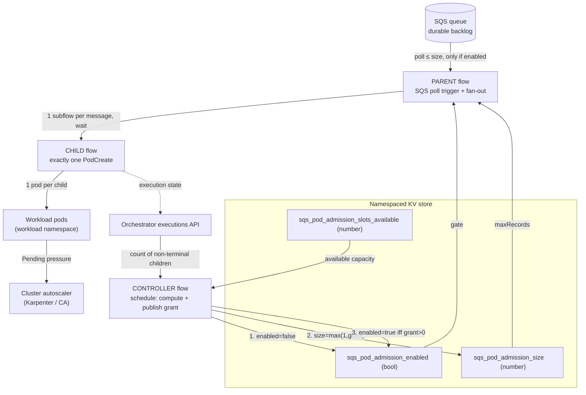

# Adaptive poll-based SQS pod admission

A pattern for turning a queue of work into Kubernetes pods **at a rate the cluster
can actually absorb**, while keeping the backlog durably in the queue.

This document is implementation-agnostic. It describes the mechanics, the moving
parts, and what you need to build it yourself. The reference implementation uses
[Kestra](https://kestra.io) as the orchestrator and AWS SQS as the queue.

---

## 1. Why this exists

An orchestrator that converts queue messages into pods can create work far faster
than a cluster autoscaler (Karpenter, Cluster Autoscaler, …) can add nodes. A
burst of messages becomes:

- a burst of `Pending` pods (best case)
- or a burst of **rejected** pod creations if a namespace `ResourceQuota` is in
  play, which produces no `Pending` pods and therefore **no signal** for the
  autoscaler to grow.

What you want instead:

1. a **bound** on how many workload pods are active or `Pending` at once
2. a **small, deliberate** amount of `Pending` pressure, so the autoscaler still
   sees a reason to add nodes
3. the rest of the backlog to **stay in the queue**, durably, until capacity is
   ready.

This pattern puts a capacity-aware admission decision *in front of* pod creation.

---

## 2. The core idea

**Don't drain the queue.** Poll it on an interval, and each cycle pull only as
many messages as the cluster can currently take. A separate **controller**
computes that number and publishes it to shared state; the **poller** reads it
and obeys.

Three properties make it work:

| Property | Consequence |
|---|---|
| The queue is the buffer so messages stay in SQS until admitted | No large internal execution backlog; no "release the queued executions" problem |
| One admitted message = one workload slot (strict chain) | "Count of non-terminal child executions" is an exact count of reserved capacity —> no need to inspect pod counts Kubernetes if this invariant holds |
| The admission number lives in mutable KV, not in flow definitions | The controller rewrites it every cycle; the poller re-reads it every cycle |

---

## 3. The invariant

```
1 queue message
  → 1 child execution      (created by the parent's fan-out)
    → 1 PodCreate task      (the ONLY task in the child that makes a pod)
      → 1 workload pod       (in the workload namespace)
        = 1 logical slot     (held until the child execution is terminal)
```

Because the child flow contains **exactly one** pod-creating task and nothing
else, a non-terminal child execution and a live workload pod are the same thing.
Counting child executions through the orchestrator API is therefore a reliable
proxy for "pods I am currently responsible for", *including* the ones still
queued inside the orchestrator that have not created their pod yet.

If you break this invariant (two pods per child, a child that sometimes makes
zero pods, multiple resource profiles through one child), the count stops meaning
"slots" and the whole scheme loses its footing. In this case you could adapt the mechanics 
to incorporate real k8s pod count for instance.

---

## 4. The moving parts



### 4.1 The queue

The durable backlog. A standard queue; messages are the unit of work. Notes:

- The poller **deletes messages when it fetches them**, not when the downstream
  pod finishes (see 9.4).
- Set a visibility timeout comfortably larger than one poll cycle.

### 4.2 Three KV entries

All in the orchestrator's **flow namespace**. One key prefix per workload family.

| Key | Type | Written by | Read by | Meaning |
|---|---|---|---|---|
| `sqs_pod_admission_enabled` | boolean | controller | parent trigger **condition** | Intake gate. `true` → a poll cycle may consume. `false` → cycle is a no-op. |
| `sqs_pod_admission_size` | number | controller | parent trigger **`maxRecords`** | Max messages one poll cycle may consume. Always ≥ 1 (see §9.3). |
| `sqs_pod_admission_slots_available` | number | operator / capacity job | controller | How many slots the cluster can currently absorb. The capacity signal. |

A second workload with a different resource profile gets its **own** prefixed KV entries. KV entries are namespaced
shared state, readable and writable by any flow in the namespace and by the API.

### 4.3 Parent flow: the poller + fan-out

**Trigger:** a batch-polling SQS trigger (fetch up to `maxRecords` messages, once
per `interval`).

- `maxRecords: "{{ kv('sqs_pod_admission_size') }}"`, dynamic, re-read every poll.
- `conditions:` an expression on `kv('sqs_pod_admission_enabled')`, a closed
  gate makes the whole cycle a no-op; messages stay in the queue
- `allowConcurrent: false`, one parent execution at a time
- `autoDelete: true` and an explicit `visibilityTimeout`

**Body:** a single `ForEachItem` task

- `items:` the file of fetched message bodies the trigger produced,
- `batch: { rows: 1 }` one child execution per message,
- `wait: true` the parent stays non-terminal until every child finishes,
- `flowId:` the child flow; passes the message payload, the parent execution id,
  and the resource profile as inputs.

Net effect per open poll: pull ≤ `size` messages, start that many children, wait.

### 4.4 Child flow: one pod

- **Inputs:** the message payload (as a file), the parent execution id (for
  traceability), and the pod resource profile (`cpu_request`, `memory_request`,
  image, sleep/runtime).
- **One pod-creating task** (`PodCreate`) into a **workload namespace** that is
  separate from the orchestrator's namespace:
  - `restartPolicy: Never`, resource `requests`and  `limits` set,
  - `waitRunning` / `waitUntilRunning` timeouts bound how long a stuck pod holds a slot,
  - `delete: true` (clean up the pod on completion), `resume: false`.
- **Pod labels** carry the parent execution id and the child execution id, so
  pods ↔ executions are correlatable

The child remains non-terminal for the whole pod lifetime which is what makes
the controller's execution count equal to the live-pod count for that workload.

### 4.5 Controller flow: compute and publish the admission number

**Trigger:** a `Schedule` (e.g. every 5s), `allowConcurrent: false`.
**Flow concurrency:** `limit: 1`, `behavior: CANCEL` so a newer reconciliation cancels a stale queued one rather than applying it later.

Tasks, **in this order**:

| # | Task | Action |
|---|---|---|
| 1 | `close_intake` | `sqs_pod_admission_enabled = false` fail closed first. |
| 2 | `query_active_children` | HTTP GET `…/executions/search`, filtered to the **child flow id** + **every non-terminal state** + `childFilter=CHILD`. Returns `total`. |
| 3 | `calculate_grant` | `grant = max(0, slots_available + overflow − total)`. `slots_available` is read from KV. |
| 4 | `set_batch_size` | `sqs_pod_admission_size = max(1, grant)`. |
| 5 | `open_intake_when_granted` | **only if `grant > 0`:** `sqs_pod_admission_enabled = true`. |

---

## 5. Why the write order matters

Note that if you rather wannt different "fail-safe" behaviour adjust the controller accordingly:

```
1. enabled = false           # stop new consumption immediately
2. size    = max(1, grant)    # safe to publish — intake is already closed
3. enabled = true   iff grant > 0
```

- Controller crashes after step 1 → intake stays closed → **safe**.
- Controller crashes after step 2 → `size` updated but `enabled` still false →
  **safe**.
- Only a clean run through step 3 re-opens the gate.

The gate is closed *before* every recompute so that a stale `size` is never live
while the controller is mid-calculation.

---

## 6. One full cycle (worked example)

Assume `slots_available = 10`, `desired_pending_overflow_slots = 2`, child pods
sleep 60s, controller runs every 5s, parent polls every 10s.

| t | Event | `enabled` | `size` | non-terminal children |
|---|---|---|---|---|
| 0s | Steady state, queue has 50 messages | true | 12 | 0 |
| 1s | Parent poll: consumes 12, starts 12 children | true | 12 | 12 |
| 5s | Controller: `grant = 10 + 2 − 12 = 0` → `size = max(1,0) = 1`, `enabled = false` | **false** | 1 | 12 |
| 6s–60s | Parent polls fire but the condition is false → **no consumption**; 38 messages wait in SQS | false | 1 | 12 |
| ~62s | 12 pods finish, 12 children reach `SUCCESS` | false | 1 | 0 |
| 65s | Controller: `grant = 10 + 2 − 0 = 12` → `size = 12`, then `enabled = true` | true | 12 | 0 |
| 71s | Next parent poll consumes 12 more | true | 12 | 12 |

The queue drains in waves of ~12, paced to keep in-flight pods near `10 + 2`.

---

## 7. The capacity signal

`sqs_pod_admission_slots_available` is the one number that says "how big can the
in-flight set be". Today an operator sets it (script or KV UI). Raise it to admit
more; drop it to simulate lost capacity.

Later, replace the source with a small job that computes it from real cluster
state — **nothing else in the pattern changes**:

```
slots_available = Σ over eligible Ready nodes:
    floor( min( allocatable_cpu / pod_cpu_request,
                allocatable_mem / pod_mem_request,
                … )  ×  safety_factor )
```

- **Eligible** = nodes the workload pod can actually land on: right
  nodepool/labels, tolerated taints, matching architecture, compatible resource
  profile.
- `safety_factor` (~0.8–0.9) reserves headroom for DaemonSets and kubelet
  overhead. Refine it from observed packing.
- It stays a **proxy**, not a scheduler prediction. The admission scheme is
  designed to tolerate a rough number.

`desired_pending_overflow_slots` is a deliberate extra on top of
`slots_available`. It is *not* a count of pods already `Pending`; it is how many
pods you are willing to leave unschedulable to prod the autoscaler. Keep it small
and cap it.

---

## 8. Why `allowConcurrent: false` everywhere

| Where | Without it |
|---|---|
| Parent trigger | Two overlapping poll cycles each fan out pods against the same stale `size` → double admission. |
| Controller trigger | Two reconciliations race on the KV writes. |
| Controller flow concurrency (`CANCEL`) | A scheduled tick and a manual run collide; the older one should be dropped, not queued to apply stale numbers later. |

This is **coarse serialization**, not a distributed lock (see §9.5).

---

## 9. Known limitations: What this pattern does *not* solve

1. **Execution-visibility lag.** Between "parent consumed a batch" and "all its
   children are visible to `executions/search`", the controller under-counts
   reservations. If that lag is not safely below the controller interval, the
   next cycle over-admits. **Fix:** have the parent write its accepted count into
   a KV pending/epoch counter that the controller *adds* to the API count until
   the children materialize.
2. **Non-atomic KV writes.** The 3-step order is crash-safe, but a poll cycle
   *already in flight* when the gate closes cannot be revoked.
3. **`size` cannot be 0.** The SQS `Consume` implementation does one receive
   before evaluating its `maxRecords` stop condition, so `maxRecords: 0` still
   pulls a message. The `enabled` gate is the real zero; the controller writes
   `max(1, grant)`.
4. **`autoDelete` acknowledgement semantics.** Messages are deleted when fetched,
   before the workload pod succeeds. A pod failure loses the message. Use
   idempotent messages, or drop `autoDelete` and delete explicitly after the
   child succeeds.
5. **Not a distributed admission lock.** `allowConcurrent: false` + a
   single-replica controller is coarse serialization. A production version wants
   one elected actor, durable reservation state, reconciliation against the API,
   and fail-closed behavior on any API/cluster error.
6. **Coarse granularity.** A freed slot or a newly Ready node is not used until
   the next poll interval. Acceptable when node provisioning time and pod runtime
   dominate that interval.

---

## 10. Implementing it yourself

### Prerequisites

- A dedicated queue for this workload.
- An orchestrator with: a batch-polling queue trigger, a namespaced KV store, an
  executions-search API, a schedule trigger, and a pod-create task.
- A **workload namespace** separate from the orchestrator's namespace.
- A cluster autoscaler with a nodepool cap.

### Build order

1. **Child flow** — exactly one pod-creating task into the workload namespace;
   labels linking pod → parent execution → child execution.
   Test it standalone first.
2. **Parent flow** — batch-poll trigger with `maxRecords` from KV and an
   enable-gate condition from KV; `allowConcurrent: false`; one `ForEachItem`
   (`rows: 1`, `wait: true`) launching the child.
3. **Controller flow** — schedule trigger; `concurrency 1 / CANCEL`; tasks in
   order **close → count → compute → size → open**.
4. **Seed the KV**: `enabled = false`, `size = 1`, `slots_available = <n>`.
5. Give the controller a **scoped API credential** (read executions only) and a
   **reachable API URL** (see below).
6. A way to set `slots_available` — script or UI now, capacity job later.

### Align the ceilings

```
controller admission cap  ≤  workload-namespace ResourceQuota  ≤  autoscaler nodepool max
```

If you use a `ResourceQuota`, size it for **baseline + overflow**. A quota that is
too tight rejects `PodCreate` at the API instead of letting pods go `Pending`, 
which starves the autoscaler (in case it's based on unschedulable pods) of the very signal you are trying to create.

### API-reachability note

The controller's `executions/search` call must reach an orchestrator
API/webserver endpoint. If the orchestrator sits behind an ingress/route that
terminates TLS, an **in-cluster** call to `https://…` against the plain-HTTP
backend Service fails the TLS handshake. Use the in-cluster Service on its HTTP
port (e.g. `http://<service>.<namespace>.svc.cluster.local:<port>`), or the
external URL. In a split deployment, target the component that serves the REST
API (the *webserver*), not a worker/executor Service.

---

## 11. Tuning knobs

| Knob | Where | Effect |
|---|---|---|
| trigger `interval` | parent | Admission responsiveness vs. poll/API load. |
| controller `cron` | controller | How fast grants react to finished work and capacity changes. |
| `sqs_pod_admission_slots_available` | KV | The baseline admission ceiling. |
| `desired_pending_overflow_slots` | controller input | How hard you push the autoscaler. |
| `maxRecords` / `maxDuration` | parent trigger | Batch shape per poll. |
| child `waitRunning` / `waitUntilRunning` | child | How long a slot is held on a stuck pod. |
| `visibilityTimeout` | parent trigger | Redelivery window if a parent dies mid-batch. |

